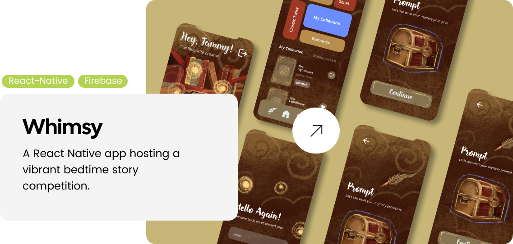

   <!-- 

  
  
 -->

  

## Hi there, I'm Alexa 👋
### So a bit about me...
  
### Let's Connect!
Curious to know what I'm all about as a Dev and UX/UI Designer?

Join me for a quick 30-second elevator pitch where I introduce myself and share a glimpse of my work.

Click the image above to meet me and witness a brief preview of my journey. Let's embark on a creative adventure together!

## Take a Peak at Some of My Work 👀
### Juicier
Let's start off with the first project of the year, one that pushed me creatively and technically - Jucier.

Juicier is a full MERN stack application that allows users to keep track of their ingredient and burger inventory across the franchises different locations! It allows for easy inventory management, ensuring users a quick and easy solution to their management needs!

### Whimsy
Now onto one of my all time favourites - Whimsy.

Whimsy, a cross-platform mobile app developed using React Native and Firebase, is an engaging platform centered around a captivating bedtime story competition. Writers compete across genres to craft the most captivating bedtime short story, vying for inclusion in the revered "Dreamland Storybook." Being featured in this collection amplifies visibility for emerging authors, potentially catching the eye of publishers.

### Nova
The next project was a group effort - Nova.

Nova is a comprehensive management system that empowers creative web development agencies to manage their projects, teams, and resources efficiently. It provides a centralized platform for overseeing client work, project progress, and collaboration, resulting in an organized and productive agency workflow.

### FaceFit Meadow
Ending off with my favourite project - Facefit Meadow.

FaceFit Meadow is a revolutionary React Native app designed to inspire and assist children facing unique health challenges, such as Facial Nerve Palsy and Neuromuscular Disorders. It transforms facial therapy and facial exercise into an enjoyable and engaging experience.

## Let's Dig a Little Deeper 📊
Now you have an idea of what I'm capable of, but let's look into that more - here I've provided, my skills, stats and some other useful information.
## My Skills

More Skills

 

 

### Tech Stack
                 
### GitHub Stats

    
     
    
     
    

### Profile visits

<!-- Proudly created with GPRM ( https://gprm.itsvg.in ) -->

## Contact Me 📱

Feel free to reach out to me through the following channels:

- 📧 Email: alexapettitt14@gmail.com
- 🌐 LinkedIn: [My LinkedIn Profile](https://www.linkedin.com/in/alexa-pettitt-b8326621b/?originalSubdomain=za)
- 📷 Instagram: [@byAlexaPettitt](https://www.instagram.com/byalexapettitt/?hl=en)
- 📄 [CV Download](https://drive.google.com/file/d/1tIV_PuxgSWxdeTh9n1hfN7IxBshOtChT/view)
- 🌐 [My Website](https://alexa-pettitt-portfolio.webflow.io/)

